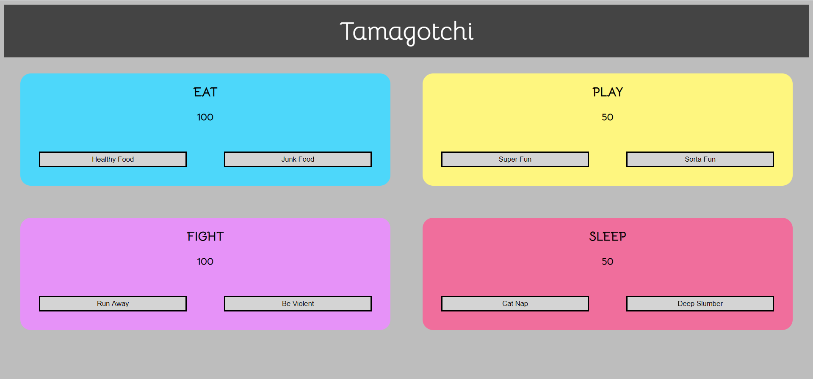

# Tamagotchi

### Description:
This project is an introduction to using Sass to style our app.

- Use webpack modules, eslint, and babel.
- No Bootstrap was used for this project
- [Homework Readme Here](https://github.com/nss-nightclass-projects/exercise-vault/blob/master/MODULES_tamagotchi.md)

## Screenshot:
#### Main view

## How to run
1. Clone down this repo
1. Make ure you have http-server installed via npm. If not get it [here](https://www.npmjs.com/package/http-server)
1. On your command line, run `hs -p 9999`
1. In your browser go to `http://localhost:9999`